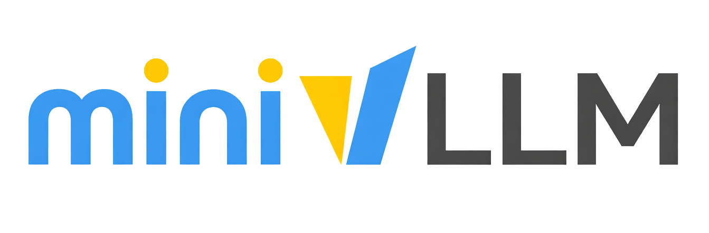

<p align="center">
  
</p>

<p align="center">
| <a href="./README.md"><b>English</b></a> 
| <a href="./README_zh.md"><b>简体中文</b></a> |
</p>

# miniVLLM

首先，感谢原作者提供了一个最小版本的 vLLM 实现，让学习 vLLM 变得更加容易。不过，原 MiniVLLM 项目并不完善，其中存在不少 Bug，无法可靠地跑通端到端的张量并行（TP）推理流程，推理调度和 KV Cache 管理也有许多逻辑漏洞。

本项目提供了一个可以完整运行的 MiniVLLM 推理框架，修复了原项目中的各种 Bug，并在此基础上持续增加新特性。Bug 修复和新特性会以 Release 的形式发布，每个 Release 都会标注对应的 Commit ID 区间。学习者可以跟随 Release，一步一步地修复 Bug、学习新特性，也可以尝试添加自己的新特性。

> **推理测试起点：** [Release 8](https://github.com/YOUR_USERNAME/MinivLLM/tree/release-8) 是本项目第一个可以完整端到端运行（fully end-to-end runnable）的 Release。进行推理或 Benchmark 测试时，请从 Release 8 或更新版本开始；此前版本是渐进式学习节点，不保证能够跑通完整推理流程。

## 最近发布

| Release | Commit 区间 | Tag | 主要内容 | 文档 |
|---|---|---|---|---|
| Release 1 | `23d95ae–acdac94` | [`release-1`](https://github.com/YOUR_USERNAME/MinivLLM/tree/release-1) | 跨请求 Prefix Cache Block 复用与感知 Prefix 的 KV Cache 分配 | [简体中文](releases/release-1_zh.md) · [English](releases/release-1.md) |
| Release 2 | `798b455` | [`release-2`](https://github.com/YOUR_USERNAME/MinivLLM/tree/release-2) | 上下文限制、KV Cache 容量与 Decode Block 分配边界 | [简体中文](releases/release-2_zh.md) · [English](releases/release-2.md) |
| Release 3 | `686b547` | [`release-3`](https://github.com/YOUR_USERNAME/MinivLLM/tree/release-3) | Prefix Cache 命中后基于完整 KV Context 的 Prefill Attention | [简体中文](releases/release-3_zh.md) · [English](releases/release-3.md) |
| Release 4 | `4d1760d` | [`release-4`](https://github.com/YOUR_USERNAME/MinivLLM/tree/release-4) | Qwen3 张量并行 Checkpoint 加载与严格验证 | [简体中文](releases/release-4_zh.md) · [English](releases/release-4.md) |
| Release 5 | `ee950af` | [`release-5`](https://github.com/YOUR_USERNAME/MinivLLM/tree/release-5) | 多 GPU 协同、调度公平性、数值稳定性与 CUDA Graph 正确性 | [简体中文](releases/release-5_zh.md) · [English](releases/release-5.md) |
| Release 6 | `dcff99f–f71bd44` | [`release-6`](https://github.com/YOUR_USERNAME/MinivLLM/tree/release-6) | Split-KV GQA Decode Kernel、分块 MMA、稳定归约与约 75× Kernel 级加速 | [简体中文](releases/release-6_zh.md) · [English](releases/release-6.md) |
| Release 7 | `7d1b0f1–5608dc3` | [`release-7`](https://github.com/YOUR_USERNAME/MinivLLM/tree/release-7) | Qwen3-32B 集成、Large-scale Attention 与 TP 单次下载启动 | [简体中文](releases/release-7_zh.md) · [English](releases/release-7.md) |
| **Release 8** | `1e73f71–10f61d4` | **[`release-8`](https://github.com/YOUR_USERNAME/MinivLLM/tree/release-8)** | **首个可以完整端到端运行的 Release，推荐从该版本开始进行推理测试。** 包含 Qwen3-32B 压力测试以及 BF16、KV Cache、TP 清理与 CUDA Graph 修复。 | [简体中文](releases/release-8_zh.md) · [English](releases/release-8.md) |

自定义实现的vLLM推理引擎，基于Nano-vLLM。添加了注意力机制的基准测试，以及Pageattention、FlashAttention的代码实现。

提供了预填充阶段的FlashAttention以及解码阶段的Pageattention的基准测试。


**第一次接触vLLM?** 阅读 [HowToApproachvLLM_zh.md](HowToApproachvLLM_zh.md) 从零开始实现vLLM！学习vLLM中layers、models、Pageattention、FlashAttention、CUDA graphs以及调度实现。

## 快速开始

```bash
# 安装 uv package manager
curl -LsSf https://astral.sh/uv/install.sh | sh

# 同步依赖
uv sync

# 运行推理引擎
uv run python main.py

# prefilling 基准测试
uv run python tests/benchmarks/benchmark_attention_prefill.py

# decoding 基准测试
uv run python tests/benchmarks/benchmark_attention_decode.py --mode benchmark
```

## 每个脚本的作用

```bash
uv run python main.py
```
主推理引擎演示入口

演示了使用自定义引擎实现的完整 LLM 推理流程：
- 基于 Qwen3-0.6B，采用随机初始化
- 创建60个聊天 prompt（2个基础 prompt 各重复30次）
- 通过自定义 LLM 引擎使用批处理处理 prompt
- 使用 Pageattention 和 KV cache 管理来提高推理效率
- 每个 prompt 生成最多256个 tokens，采用温度采样

展示了自定义vLLM实现如何处理带有内存高效注意力的批量文本生成。


```bash
uv run python tests/benchmarks/benchmark_attention_prefill.py
```

预填充阶段对比

比较了在**预填充阶段**（处理输入提示）期间的三种注意力实现：

1. **PyTorch Standard（O(N²) memory）**：传统的注意力机制，会生成完整的注意力矩阵
2. **Naive Triton（O(N²) memory）**：使用 GPU 内核的注意力机制，也使用 O(N²) 内存，受共享内存限制（≤128 tokens）
3. **FlashAttention（O(N) memory）**：内存高效的在线 softmax 算法，通过块处理注意力


```bash
uv run python tests/benchmarks/benchmark_attention_decode.py --mode benchmark
```

解码阶段对比

比较了在**解码阶段**（一次生成一个输出 token）使用的生产实现：

1. **原始 Paged Attention Decode**：原始单阶段 Triton 实现
2. **Large-scale Split-KV Decode**：Qwen3-32B 使用的两阶段 GQA 优化实现

该 Driver 还提供正确性与 CUDA Profiling 模式。完整说明见[测试与 Benchmark 目录](tests/README.md)。


## 项目结构

```
myvllm/
├── src/
│   └── myvllm/           # 核心vllm实现
│       ├── models/       # 模型实现
│       ├── engine/       # LLM引擎逻辑，包括输入提示的序列定义，KV Cache的块管理，基于迭代的序列调度器，预填充和解码器，以及用于生成API接口的引擎
│       ├── layers/       # 模型组件
│       ├── utils/        # 全局变量
│       └── sampling_parameters.py 
├── main.py              # 推理演示
└── tests/
    ├── test_*.py             # 单元测试与回归测试
    ├── benchmarks/           # CUDA 与端到端 Benchmark
    └── results/              # 已提交的 Benchmark 结果
```

## 运行环境

- Python ≥3.11, < 3.12
- CUDA-capable GPU
- 依赖: `transformers`, `torch`, `xxhash` (使用uv进行管理)


## Star History

[](https://www.star-history.com/?utm_source=chatgpt.com#YOUR_USERNAME/MinivLLM&type=date&legend=top-left)
